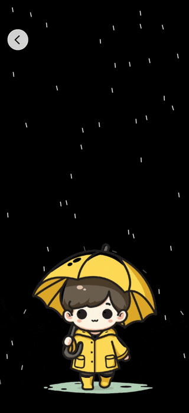
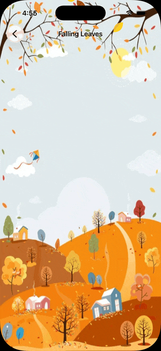
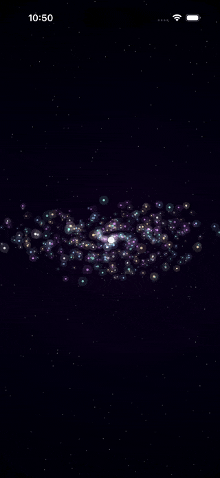

# ParticleFX

A growing SwiftUI project showcasing particle effects built with pure Canvas.
No SpriteKit. No Metal. Just SwiftUI.

## Effects
- Ep.1 — Rain 🌧️
- Ep.2 — Falling Leaves 🍂
- More coming...

## Screenshots(gifs)

<table>
  <tr>
    <td width="25%"></td>
    <td width="25%"></td>
    <td width="25%"></td>
    <!-- <td width="25%"></td> -->
  </tr>
</table>

## Requirements
- iOS 16+
- Xcode 15+
- Swift 5.9+

## Setup
1. Clone the repo
2. Open ParticleFX.xcodeproj
3. Add your own image assets or use placeholders
4. Run on simulator or device

## License
MIT — free to use, modify and share.